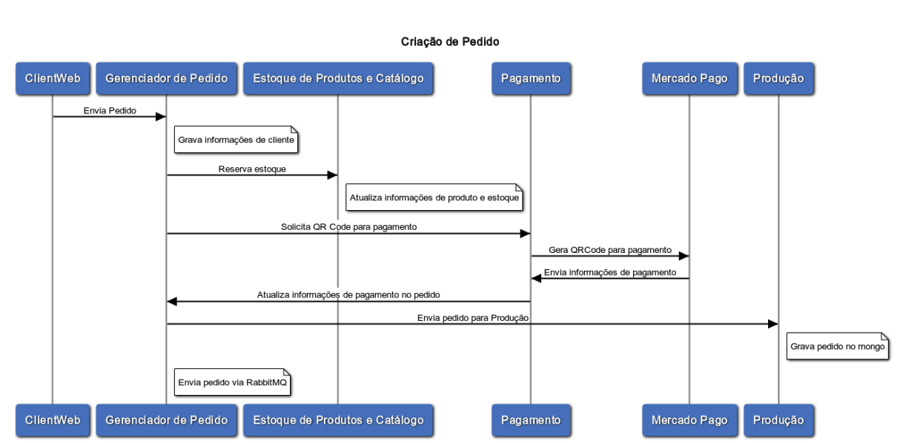

## fastfood-order-management

Serviço responsável pelo gerenciamento de pedidos do sistema fastfood:

- Registro de clientes
- Validação do estoque
- Criação dos dados de pagamento
- Envio de dados do pedido (via Rabbit)
<br>
<br>
***
### [Api Pedido](#Api Pedido)

#### **Pedido**
- Cadastro de novos pedidos


Exemplo Payload :
```javascript
{
  "produtos": [
    {
      "id": 1,
      "nome": "Cheese Burger",
      "descricao": "pao, hamburguer, alface, queijo, molho especial",
      "preco": 15.5,
      "categoria": "LANCHE",
      "quantidade": 1
    }
  ],
  "cliente": {
    "nome": "Nome Sobrenome",
    "cpf": "123.456.789-09",
    "email": "cliente@email.com"
  },
  "status": "RECEBIDO",
  "dataCriacaoPedido": "2024-01-21T16:05:07.219Z",
  "valorTotal": 15.5
}
```

<br>
<br>

#### **Fluxo Criação Pedido**



<br>

### [Tecnologias](#Tecnologias)
***
* Java
* Spring Boot
* Swagger
* MySQL
* RabbitMQ
* Docker
* Kubernetes

<br>

### [Grupo 7](#grupo-7)
***
* Jackson Carlos Leite Ramalho
* Valqueline Nicácio da Silva
